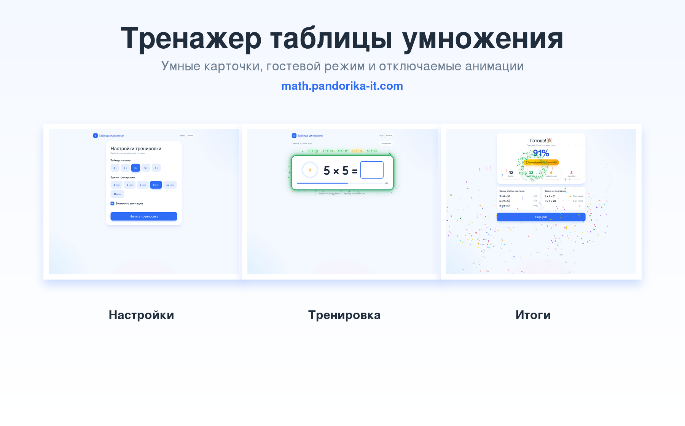

# Тренажер таблицы умножения

Умный онлайн-тренажер таблицы умножения для детей. Приложение запоминает,
какие примеры даются труднее, чаще возвращает слабые карточки и помогает
тренироваться короткими сессиями без лишнего шума.

**Демо:** [math.pandorika-it.com](https://math.pandorika-it.com)  
Можно начать сразу в гостевом режиме, без регистрации.



## Возможности

- Умный подбор карточек: слабые, новые и давно не повторявшиеся примеры появляются чаще.
- Таймер на ответ и ограничение длительности тренировки.
- Гостевой режим без регистрации: прогресс хранится в браузере.
- Пользовательский режим с сохранением прогресса в базе данных.
- Повтор ошибки: неверный пример остается, пока ребенок не ответит правильно.
- Итоги тренировки: средний балл, быстрые/медленные ответы, ошибки, слабые карточки.
- Переключатель анимаций: можно отключить комбо-эффекты, тряску и фейерверки.
- Адаптивный интерфейс для desktop, планшета и телефона.

## Стек

- Next.js 15, React 19, TypeScript
- Tailwind CSS 4
- Prisma ORM + SQLite
- bcryptjs + HTTP-only cookie session
- Vitest
- Docker для production-деплоя

## Быстрый старт

Требуется Node.js 20+ и npm.

```bash
npm ci
cp .env.example .env
npm run setup
npm run dev
```

После запуска открой `http://localhost:3000`.

Локальный пользователь из seed:

```text
Amelia / 12345
```

Также доступен гостевой режим: `/guest`.

## Скрипты

| Команда | Что делает |
|---|---|
| `npm run dev` | Запускает Next.js в режиме разработки |
| `npm run build` | Генерирует Prisma Client и собирает production build |
| `npm run start` | Запускает собранное приложение |
| `npm test` | Запускает unit-тесты |
| `npm run setup` | Prisma generate + db push + seed |
| `npm run db:push` | Синхронизирует Prisma schema с БД |
| `npm run db:seed` | Заполняет карточки и пользователей |

## Как работает подбор карточек

Карточка получает priority score. Чем он выше, тем вероятнее карточка попадет в
следующий вопрос:

```text
priority = (1 - recentAverageScore) * 60
         + overdueScore            * 25
         + newCardScore            * 30
         + random(0..10)
```

Правила:

- `7 × 8` и `8 × 7` считаются одной карточкой для статистики, но могут
  показываться в обе стороны.
- Правильно до таймера: `100%`.
- Правильно после таймера: `50%`.
- Неверно: `0%`.
- Первый пример в сессии идет без таймера.
- Недавно показанные карточки временно исключаются, чтобы не было частых повторов.

Чистая логика лежит в `src/lib/` и покрыта тестами: генерация карточек,
канонизация, скоринг, EMA-статистика, overdue, анти-повтор и weighted random.

## Структура

```text
prisma/schema.prisma        модели User, Card, UserCardStats, Attempt, Session
prisma/seed.ts              стартовые карточки и пользователи
src/app/                    Next.js App Router, страницы и API routes
src/components/             экраны настроек, тренировки, итогов и визуальные эффекты
src/lib/                    доменная логика, API-клиент, auth, Prisma helpers
docs/screens.png            общий screenshot для README
docs/screenshots/           отдельные production screenshots
deploy/                     Docker/nginx/VPS deploy scripts
```

## Тесты

```bash
npm test
```

## Production

Текущий production-деплой доступен здесь:

[https://math.pandorika-it.com](https://math.pandorika-it.com)

Приложение запускается в Docker-контейнере с Node 20. SQLite база хранится в
Docker volume, поэтому данные переживают пересборку контейнера.

Для обновления текущего VPS используется:

```bash
bash deploy/push.sh
ssh root@203.0.113.10 'cd /opt/mathcards/deploy && docker-compose up -d --build'
```

Полный первичный setup с nginx и Let's Encrypt описан в `deploy/vps-deploy.sh`.

## Переменные окружения

Минимально нужны:

```env
DATABASE_URL="file:./dev.db"
SESSION_SECRET="long-random-secret"
```

См. `.env.example`.
